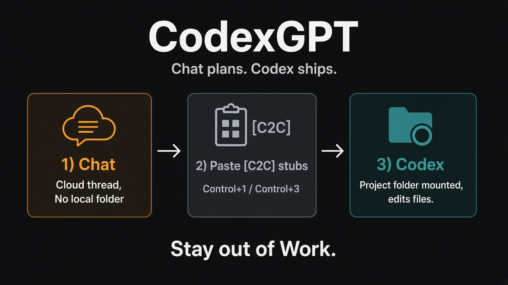

# Using CodexGPT

ChatGPT **Chat** plans and reviews. **Codex** edits, runs shells, and tests. You (or the macOS driver) move short `[C2C]` messages between them.



## The idea in one loop

```text
INIT → PLAN → EXECUTING → EXECUTED → REVIEW → PLAN | DONE | BLOCKED
```

1. Codex starts with `$codexgpt` and emits a tiny **INIT** stub.
2. You paste that into a pinned **Chat** thread.
3. Chat replies with a substantive **PLAN**.
4. You paste the PLAN into **Codex**. Codex implements.
5. Codex sends **EXECUTED** back to the **same** Chat thread.
6. Chat replies **DONE**, another **PLAN**, or **BLOCKED**.

Keep control messages under ~1 KB. Do not dump full diffs into Chat unless Chat asks for one short snippet (or the optional MCP connector can `git_diff` / `read_file`).

## Manual paste-back (any OS)

Best first path — no Accessibility, no tunnels.

1. In **Codex**, run `$codexgpt` (or “Use CodexGPT to implement X”).
2. First time: paste the **boot prompt** from [protocol.md](../.agents/skills/codexgpt/references/protocol.md) into your pinned Chat thread.
3. Copy each `INIT` / `EXECUTED` stub → `Control+1` / `Alt+1` → paste → send.
4. Copy Chat’s `PLAN` / `DONE` / `BLOCKED` → `Control+3` / `Alt+3` → paste into a **live Codex project thread** → send.
5. Repeat until Chat says **DONE**.

### What a good PLAN looks like

Chat should return reasoning first, checklist second:

- `GOAL`
- `RATIONALE` (why this approach — not a restatement of the checklist)
- `ACTIONS` (finite steps)
- `FILES_LIKELY_INVOLVED`
- `TESTS`
- `SUCCESS_CRITERIA`

Thin ACTIONS-only lists are weak plans — ask Chat to revise before Codex runs.

## macOS keystroke driver

From the repo root:

```bash
# Flip modes
node tools/codexgpt-driver.mjs to chat
node tools/codexgpt-driver.mjs to codex

# Paste + Enter in the current mode
node tools/codexgpt-driver.mjs send "hello"

# Switch to Chat, paste a stub, send
node tools/codexgpt-driver.mjs chat-send "$(cat <<'EOF'
[C2C]
STATE: INIT
TASK_ID: c2c_demo
ITERATION: 0

GOAL:
…
EOF
)"
```

`ok: true` means **keys fired**, not “Chat accepted the message.” Confirmation is the next `[C2C]` state or a file change on disk.

Prefer `send` / `chat-send` / `codex-send` **without** forcing the mode hotkey when you are already in that mode.

## Auto-loop (macOS)

```bash
node tools/codexgpt-loop.mjs --goal "…"
```

Defaults (see `codexgpt.config.json`): Chat + Codex handoff on; optional mailbox/memory notes.

If the loop cannot scrape Chat’s reply (Electron often returns empty accessibility text), copy Chat’s `[C2C]` block and run:

```bash
pbpaste | node tools/codexgpt-write-reply.mjs --from-clipboard
```

## Optional MCP review

When Chat must independently check code after `EXECUTED`:

1. `node tools/codexgpt-mcp-up.mjs start`
2. Attach the HTTPS connector in ChatGPT Developer Mode / custom plugin.
3. Tell Chat to prefer `git_diff` / `read_file` over asking for pastes.

A new tunnel URL pasted into a `[C2C]` message does **not** rebind the connector — edit connector settings when the URL changes.

Details: [mcp/README.md](../mcp/README.md).

## Explainer site (optional)

This repo also ships a Next.js write-up:

```bash
pnpm install
pnpm dev
```

Open [http://127.0.0.1:43127](http://127.0.0.1:43127).

## Protocol reference

Full templates: [`.agents/skills/codexgpt/references/protocol.md`](../.agents/skills/codexgpt/references/protocol.md)  
Keyboard notes: [`.agents/skills/codexgpt/references/keyboard.md`](../.agents/skills/codexgpt/references/keyboard.md)

Stuck? See [Troubleshooting](troubleshooting.md).
